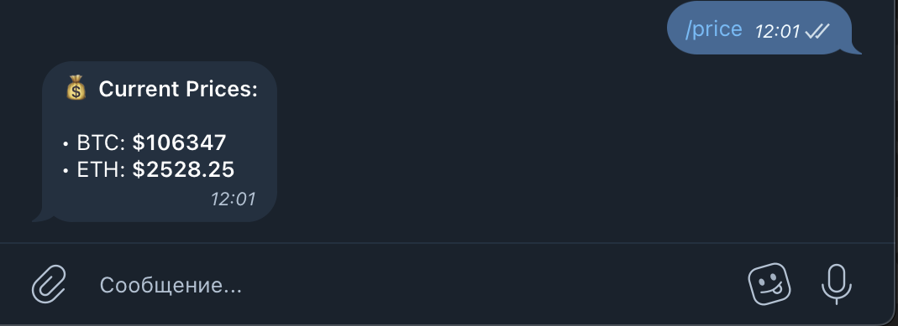
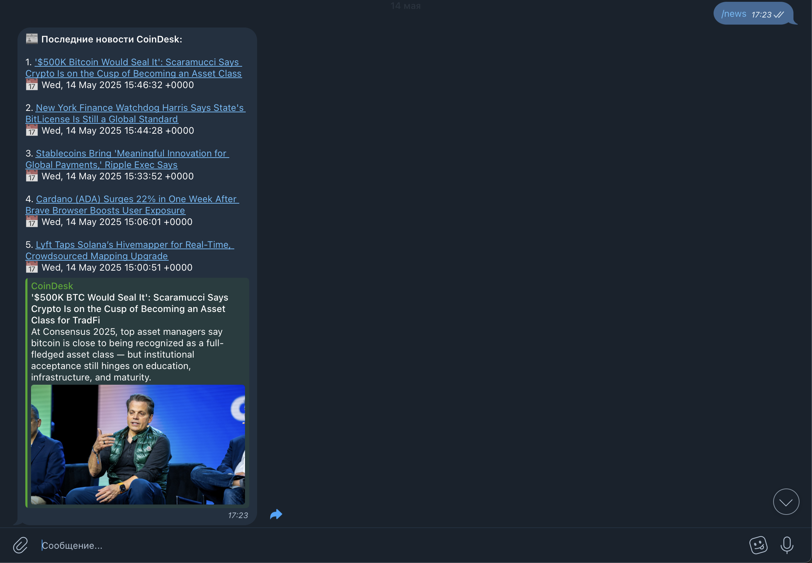

# Telegram Trading Bot 🛠️

Telegram bot for live crypto prices, crypto news feed, and simulated trading.  
👉 Try it in Telegram: [@SignalForgeBot](https://t.me/SignalForgeBot)

---

## ✨ Features

- `/ping` — проверка отклика бота  
- `/price` — текущие цены BTC и ETH (CoinGecko API)  
- `/news` — последние крипто-новости с CoinDesk (RSS)  
- `/buy BTC` или `/buy ETH` — симуляция покупки по текущей цене  

---

## 🖼️ Preview

| Команда    | Скриншот |
|------------|----------|
| `/price`   |  |
| `/news`    |  |
| `/buy BTC` |  |

---

## 🔧 Стек

- Node.js  
- Telegram Bot API (`node-telegram-bot-api`)  
- CoinGecko API  
- CoinDesk RSS (`rss-parser`)  
- Axios  
- dotenv

---

## 🚀 Установка

```bash
git clone https://github.com/Puchao64/telegram-trading-bot.git
cd telegram-trading-bot
npm install
